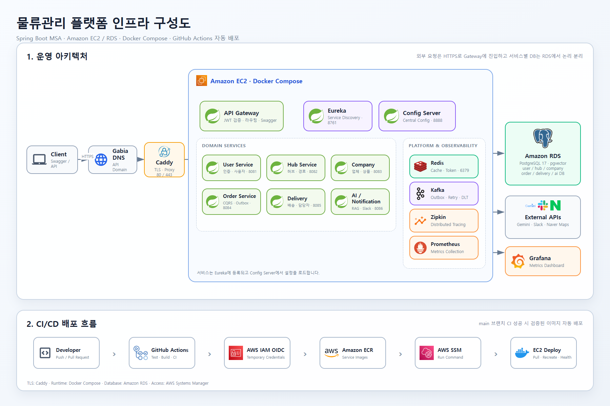

# 🚚 물류관리 플랫폼 (Logistics Platform)

> Spring Boot 기반 MSA 구조로 구현하는 물류·주문·배송 관리 플랫폼


## 📌 프로젝트 소개

허브, 업체, 상품, 주문, 배송 정보를 하나의 흐름으로 관리하는 물류관리 백엔드 플랫폼입니다.

서비스별 책임과 데이터베이스를 분리한 MSA 구조를 사용하며, API Gateway를 통해 외부 요청을 단일 진입점으로 관리합니다. 기본 기능은 REST 기반 동기 통신으로 구현하고, AI 알림 서비스는 Spring AI와 Gemini, pgvector 기반 RAG 및 Slack 알림 연동을 지원합니다.

주문 생성 실패 후 배송 보상 취소가 실패하는 경우를 대비해 Outbox와 Kafka 기반 재처리를 적용했습니다. 운영 환경은 GitHub Actions, Amazon ECR, EC2, RDS, Caddy로 구성하며 `main` CI 성공 시 검증된 이미지를 자동 배포합니다.

## 🎯 주요 목표

- 서비스별 책임과 데이터 저장소가 분리된 MSA 구성
- API Gateway와 JWT를 이용한 인증·인가 및 공통 요청 처리
- Eureka를 이용한 서비스 등록·탐색
- Config Server를 이용한 서비스 설정 중앙 관리
- PostgreSQL 및 pgvector를 이용한 서비스 데이터와 RAG 데이터 관리
- Redis를 이용한 캐시 및 인증 보조 데이터 관리
- Outbox와 Kafka를 이용한 배송 보상 실패 이벤트 영속화 및 재처리
- Spring AI와 Gemini를 이용한 AI 기능 구현
- Slack을 이용한 주요 업무 알림 전송
- Docker Compose를 이용한 동일한 로컬 개발 환경 제공
- GitHub Actions를 이용한 테스트 및 빌드 자동화
- ECR, EC2, RDS와 SSM을 이용한 운영 배포 자동화

## 🏗️ 인프라 구성도



[수정 가능한 아이콘 구성도 원본](docs/infrastructure-diagram-icons.html)

로컬은 Docker Compose로 PostgreSQL, Redis, Kafka, Zipkin과 전체 서비스를 실행합니다. 운영은 RDS PostgreSQL을 외부 DB로 사용하고, ECR 이미지를 EC2의 Docker Compose로 실행합니다. Caddy가 API Gateway 앞에서 TLS 인증서 발급과 HTTPS 역프록시를 담당합니다.

## 👥 팀원 및 역할 분담

| 이름 | 담당 역할 |
|---|---|
| 김태희 | 인프라, API Gateway, Order Service |
| 나상우 | User Service, API Gateway |
| 김민지 | Hub Service |
| 강윤석 | Company·Product Service |
| 강소율 | Delivery Service |
| 이용현 | 팀리더, AI·Notification Service |

## 🧩 서비스 구성

| 애플리케이션 | 포트 | 역할 |
|---|---:|---|
| API Gateway | `8080` | 외부 요청 진입점, 라우팅, JWT 검증, 공통 필터 |
| Eureka Server | `8761` | 마이크로서비스 등록 및 탐색 |
| Config Server | `8888` | 서비스별 설정 중앙 관리 |
| User Service | `8081` | 사용자, 인증 및 권한 관리 |
| Hub Service | `8082` | 허브 및 허브 이동 정보 관리 |
| Company Service | `8083` | 업체, 상품 및 재고 정보 관리 |
| Order Service | `8084` | 주문 생성 및 상태 관리 |
| Delivery Service | `8085` | 배송 및 배송 담당자 관리 |
| AI Notification Service | `8086` | Spring AI, RAG, Gemini 및 Slack 알림 연동 |
| Kafka | `9092` | 배송 보상 실패 이벤트 전달 및 재처리 |

## 🛠️ 기술 스택

### Backend

- Java 17
- Spring Boot 3.5.16
- Spring Cloud 2025.0.0
- Spring Cloud Gateway
- Netflix Eureka
- Spring Cloud Config
- Spring Security, JWT
- Spring Data JPA
- Springdoc OpenAPI / Swagger UI

### Data & AI

- PostgreSQL 17
- pgvector
- Redis 7.4
- Apache Kafka 3.9.2
- Spring AI 1.1.8
- Google Gemini
- Slack API

### Infrastructure & Collaboration

- Docker, Docker Compose
- Git, GitHub
- GitHub Actions CI/CD, GitHub OIDC
- AWS ECR, EC2, RDS, Systems Manager
- Caddy HTTPS Reverse Proxy
- Kafka — 배송 보상 실패 이벤트 재처리에 적용

## 🔄 요청 흐름

```text
Client
  └─ HTTPS / REST
      └─ Caddy
          └─ API Gateway
          ├─ JWT 검증 및 사용자 정보 전달
          ├─ Eureka 기반 서비스 탐색
          └─ 각 도메인 서비스 호출
               ├─ RDS PostgreSQL / pgvector
               ├─ Redis
               ├─ Kafka
               └─ AI Notification Service
                    ├─ Gemini
                    └─ Slack
```

## 🗂️ 프로젝트 구조

```text
logistics-platform/
├─ api-gateway/
├─ eureka-server/
├─ config-server/
├─ config-repository/
├─ user-service/
├─ hub-service/
├─ company-service/
├─ order-service/
├─ delivery-service/
├─ ai-notification-service/
├─ infrastructure/
│  ├─ docker-compose.yml
│  ├─ docker-compose.prod.yml
│  ├─ docker-compose.ecr.yml
│  ├─ Dockerfile
│  ├─ Caddyfile
│  ├─ deploy-ec2.sh
│  └─ postgres/init.sql
├─ docs/
├─ .github/workflows/
│  ├─ ci.yml
│  └─ publish-ecr.yml
├─ build.gradle
└─ settings.gradle
```

## 🚀 시작하기

### 1. 저장소 복제

```bash
git clone https://github.com/LP-Team01/logistics-platform.git
cd logistics-platform
```

### 2. 환경 변수 설정

PowerShell:

```powershell
Copy-Item .env.example .env
```

macOS / Linux:

```bash
cp .env.example .env
```

`.env` 파일에서 다음 값을 환경에 맞게 변경합니다.

```dotenv
POSTGRES_USER=logistics
POSTGRES_PASSWORD=change-me
JWT_SECRET=MDEyMzQ1Njc4OWFiY2RlZjAxMjM0NTY3ODlhYmNkZWY=
INTERNAL_SERVICE_KEY=replace-with-random-secret
HUB_INTERNAL_SERVICE_KEY=replace-with-random-secret

GEMINI_API_KEY=
GEMINI_CHAT_MODEL=gemini-2.5-flash
GEMINI_EMBEDDING_MODEL=gemini-embedding-001

SLACK_BOT_TOKEN=
```

> `.env`와 실제 Secret은 Git에 커밋하지 않습니다.

### 3. 테스트 및 JAR 빌드

Windows:

```powershell
.\gradlew.bat clean test bootJar
```

macOS / Linux:

```bash
./gradlew clean test bootJar
```

### 4. Docker Compose 실행

```bash
docker compose --env-file .env -f infrastructure/docker-compose.yml up --build -d
```

실행 상태 확인:

```bash
docker compose --env-file .env -f infrastructure/docker-compose.yml ps
```

Kafka Topic 확인:

```bash
docker compose --env-file .env -f infrastructure/docker-compose.yml exec kafka /opt/kafka/bin/kafka-topics.sh --bootstrap-server localhost:9092 --list
```

출력에 `delivery-compensation`이 있으면 정상입니다. Topic을 생성한 `kafka-init` 컨테이너는 `Exited (0)` 상태가 정상입니다.

종료:

```bash
docker compose --env-file .env -f infrastructure/docker-compose.yml down
```

데이터 볼륨까지 삭제해야 할 때만 다음 명령을 사용합니다.

```bash
docker compose --env-file .env -f infrastructure/docker-compose.yml down -v
```

## 🔎 접속 URL

| 항목 | URL |
|---|---|
| API Gateway | <http://localhost:8080> |
| Gateway Health Check | `api-gateway` 컨테이너 내부 `http://localhost:9091/actuator/health` |
| Eureka Dashboard | <http://localhost:8761> |
| Config Server Health Check | <http://localhost:8888/actuator/health> |
| PostgreSQL | `localhost:5432` |
| Redis | `localhost:6379` |
| Kafka | `localhost:9092` |
| Zipkin | <http://localhost:9411/zipkin> |
| 운영 API / Swagger | <https://api.logistics-platfom.shop/swagger-ui.html> |

## 📖 API 문서

도메인 서비스는 Springdoc OpenAPI를 이용해 API 명세를 제공합니다. 로컬에서는 각 서비스 포트로 직접 접속할 수 있고, API Gateway Swagger UI에서 서비스별 명세를 선택할 수 있습니다.

### Swagger 접속 전 준비

먼저 Docker Compose로 전체 서비스를 실행합니다.

```bash
docker compose --env-file .env -f infrastructure/docker-compose.yml up --build -d
```

컨테이너가 정상적으로 실행 중인지 확인합니다.

```bash
docker compose --env-file .env -f infrastructure/docker-compose.yml ps
```

브라우저에서 담당 서비스의 Swagger UI 주소를 엽니다.

| 서비스 | Swagger UI | OpenAPI JSON |
|---|---|---|
| User Service | <http://localhost:8081/swagger-ui/index.html> | <http://localhost:8081/v3/api-docs> |
| Hub Service | <http://localhost:8082/swagger-ui/index.html> | <http://localhost:8082/v3/api-docs> |
| Company Service | <http://localhost:8083/swagger-ui/index.html> | <http://localhost:8083/v3/api-docs> |
| Order Service | <http://localhost:8084/swagger-ui/index.html> | <http://localhost:8084/v3/api-docs> |
| Delivery Service | <http://localhost:8085/swagger-ui/index.html> | <http://localhost:8085/v3/api-docs> |
| AI Notification Service | <http://localhost:8086/swagger-ui/index.html> | <http://localhost:8086/v3/api-docs> |

Gateway 통합 Swagger UI:

```text
로컬: http://localhost:8080/swagger-ui.html
운영: https://api.logistics-platfom.shop/swagger-ui.html
```

Gateway가 `503 Service Unavailable`를 반환하면 선택한 도메인 서비스의 헬스 상태와 Eureka 등록 여부를 먼저 확인합니다.

### Swagger에서 JWT 인증하기

인증이 필요한 API는 다음 순서로 테스트합니다.

1. 회원가입 및 로그인 API를 호출해 Access Token을 발급받습니다.
2. Swagger UI 오른쪽 위의 **Authorize** 버튼을 누릅니다.
3. 인증 입력란에 Access Token을 입력합니다.
4. **Authorize**를 누른 뒤 창을 닫습니다.
5. 테스트할 API에서 **Try it out → Execute**를 선택합니다.

Swagger 설정에 따라 입력 형식이 다를 수 있습니다.

```text
Bearer 인증 방식으로 설정된 경우: 발급받은 토큰만 입력
일반 Authorization 헤더 방식인 경우: Bearer {발급받은_토큰}
```

요청 결과가 `401 Unauthorized`라면 토큰 만료 여부와 `JWT_SECRET` 설정을 확인합니다. `403 Forbidden`이라면 로그인한 사용자의 역할이 해당 API의 요구 권한과 일치하는지 확인합니다.

### Swagger가 열리지 않을 때

```bash
docker compose --env-file .env -f infrastructure/docker-compose.yml logs -f user-service
```

- 해당 서비스 컨테이너가 실행 중인지 확인합니다.
- 서비스 포트가 다른 프로그램에서 사용 중인지 확인합니다.
- `/swagger-ui.html` 대신 `/swagger-ui/index.html`로 접속합니다.
- `/v3/api-docs`가 정상 JSON을 반환하는지 먼저 확인합니다.
- Config Server와 Eureka Server가 먼저 정상 기동됐는지 확인합니다.

## 🔎 Zipkin 분산 추적

각 Spring 서비스는 Micrometer Tracing으로 HTTP 요청의 Trace/Span을 생성하고 Zipkin으로 전송합니다. 로그의 `traceId`로 여러 서비스에 걸친 요청 흐름을 함께 조회할 수 있습니다.

로컬 UI:

```text
http://localhost:9411/zipkin
```

운영에서는 9411 포트를 외부에 공개하지 않습니다. EC2 SSH 터널을 연결한 뒤 같은 로컬 주소로 접속합니다.

```powershell
ssh -i "logistics-platform-key.pem" -L 9411:localhost:9411 ubuntu@EC2_주소
```

`TRACING_SAMPLING_PROBABILITY=1.0`은 모든 요청을 수집합니다. 트래픽이 증가하면 운영 값을 `0.1` 등으로 낮춥니다. 현재 Zipkin 데이터는 컨테이너 재시작 시 사라지는 인메모리 방식입니다.

## 🧪 테스트 및 CI

전체 테스트 실행:

```bash
./gradlew clean test
```

GitHub Actions는 `main`, `dev` 브랜치에 대한 Push 및 Pull Request에서 다음 작업을 수행합니다.

1. Java 17 환경 구성
2. 전체 Gradle 테스트 실행
3. 서비스별 Boot JAR 빌드

## 🌿 Git 협업 규칙

- 기본 개발 브랜치: `dev`
- 배포 기준 브랜치: `main`
- 기능 개발: `feature/{기능명}`
- 오류 수정: `fix/{기능명}`
- 문서 작업: `docs/{작업명}`
- `main`, `dev`에는 직접 Push하지 않고 Pull Request로 병합합니다.
- Pull Request는 최소 1명의 승인을 받은 후 병합합니다.
- 변경된 기능과 관련된 테스트 및 CI가 통과해야 합니다.

## 📐 개발 원칙

- 각 서비스는 자신의 데이터베이스만 직접 조회합니다.
- 다른 서비스의 테이블을 직접 조인하거나 수정하지 않습니다.
- 현재 서비스 간 통신은 REST/OpenFeign 기반으로 구성합니다.
- API 응답 형식과 예외 처리 규칙을 공통화합니다.
- 환경 변수와 인증 정보는 저장소에 커밋하지 않습니다.
- 이벤트 전환을 고려해 서비스 간 계약과 도메인 이벤트 후보를 문서화합니다.

## ☁️ AWS 운영 배포

`main` Push CI가 성공하면 `Publish ECR Images` 워크플로가 검증된 커밋 SHA로 서비스 이미지를 빌드합니다. GitHub OIDC로 AWS IAM Role을 임시로 인수하여 ECR에 Push하고, Systems Manager Run Command로 EC2 배포 스크립트를 실행합니다.

```text
main Push → CI 성공 → ECR Push → SSM Run Command → EC2 Docker Compose → Caddy HTTPS
```

GitHub Repository Variables:

```text
AWS_REGION
AWS_ROLE_ARN
EC2_INSTANCE_ID
```

EC2에서 `.env.prod.example`을 참고해 `.env.prod`를 작성합니다. 이 파일은 Git이 관리하지 않으며 자동 배포 시 기존 값을 읽기만 합니다.

```dotenv
SPRING_PROFILES_ACTIVE=prod
API_DOMAIN=api.logistics-platfom.shop
POSTGRES_HOST=RDS_ENDPOINT
POSTGRES_PORT=5432
POSTGRES_SSL_MODE=require
JWT_SECRET=BASE64_ENCODED_32_BYTE_SECRET
```

JWT 키는 일반 Base64로 인코딩된 32바이트 값을 사용합니다.

```bash
openssl rand -base64 32 | tr -d '\n'
```

운영 Compose 실행 및 상태 확인:

```bash
export ECR_REGISTRY=AWS_ACCOUNT_ID.dkr.ecr.ap-northeast-2.amazonaws.com
export IMAGE_TAG=DEPLOYED_COMMIT_SHA

docker compose \
  --env-file .env.prod \
  -f infrastructure/docker-compose.yml \
  -f infrastructure/docker-compose.prod.yml \
  -f infrastructure/docker-compose.ecr.yml \
  ps
```

운영 DB는 RDS PostgreSQL을 사용하며 AI DB에 `vector` Extension을 활성화합니다. RDS가 Private Subnet에 있으면 DBeaver는 EC2 SSH 터널을 통해 접속합니다.

### Session Manager 접속

EC2 인스턴스 Role에 `AmazonSSMManagedInstanceCore`를 연결하면 고정 공인 IP와 SSH 22번 포트 없이 AWS 콘솔에서 접속할 수 있습니다.

```text
EC2 → 인스턴스 선택 → 연결 → Session Manager → 연결
```

접속 후 Ubuntu 사용자로 전환합니다.

```bash
sudo -iu ubuntu
cd ~/logistics-platform
```

### Flyway 운영 주의사항

이미 적용된 `V1`, `V2` 등의 Migration 파일은 수정하지 않습니다. 스키마 변경은 항상 새 버전 파일로 추가해 checksum 불일치를 방지합니다.

## 🗓️ 향후 확장 계획

- EC2 단일 호스트에서 ECS 또는 다중 인스턴스로 확장
- ElastiCache, MSK 등 관리형 서비스 검토

## 📬 배송 보상 Outbox와 Kafka

Order Service는 주문 생성 실패 시 Delivery Service에 주문 단위 배송 취소를 먼저 동기로 요청합니다. 동기 취소까지 실패하면 주문 트랜잭션과 별개인 새 트랜잭션으로 `p_delivery_compensation_outbox`에 보상 작업을 저장합니다.

```text
주문 생성 실패
  → Delivery 동기 취소 요청
      ├─ 성공: 종료
      └─ 실패: Outbox 저장
          → 5초 간격 Publisher가 Kafka 발행
          → Delivery Consumer가 orderId 기준 배송 취소
          → 실패 시 Retry Topic에서 최대 5회 처리
          → 최종 실패 시 DLT 이동
```

| 항목 | 값 |
|---|---|
| 기본 Topic | `delivery-compensation` |
| Producer | Order Service |
| Consumer Group | `delivery-service` |
| Consumer | Delivery Service |
| 이벤트 키 | `orderId` |
| 발행 주기 | 5초 |
| 재시도 | 최대 5회, 지수 백오프 |
| 최종 실패 | `delivery-compensation-dlt` |

Kafka 발행이 실패하면 Outbox의 `published_at`을 비워두어 다음 스케줄에서 다시 시도합니다. Delivery의 주문 단위 취소는 같은 이벤트가 중복 전달돼도 같은 결과가 나오도록 멱등하게 처리합니다.

Consumer 처리 상태 확인:

```bash
docker compose --env-file .env -f infrastructure/docker-compose.yml exec kafka /opt/kafka/bin/kafka-consumer-groups.sh --bootstrap-server localhost:9092 --describe --group delivery-service
```

`CURRENT-OFFSET`과 `LOG-END-OFFSET`이 같고 `LAG`가 `0`이면 모든 이벤트가 처리된 상태입니다.

### 향후 Kafka 적용 후보

현재 Kafka는 배송 보상 실패 재처리에만 사용합니다. 주문 생성과 일반 서비스 통신은 REST/OpenFeign을 유지합니다. 일정이 허용되면 `OrderCreated`, `DeliveryStatusChanged`, `SlackMessageRequested` 이벤트의 비동기 전환을 검토합니다.

## 📚 관련 문서

- [인프라 설계서](docs/infrastructure.md)
- [인프라 구성도](docs/infrastructure-diagram.png)
- [인프라 구성도 SVG 원본](docs/infrastructure-diagram.svg)
- [Swagger / OpenAPI 가이드](docs/swagger.md)
